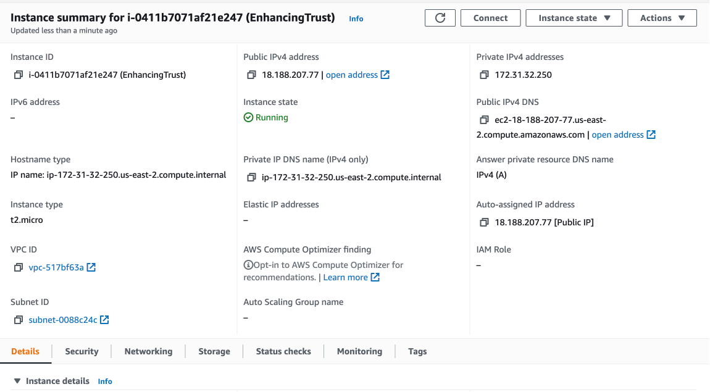

# Getting Started

This project was bootstrapped with [Create React App](https://github.com/facebook/create-react-app). In order to run this project, first install all dependencies by running the command:
```
npm install
```

Then, just run the start command to run the project locally:
```
npm start
```

## Templates
In this project we describe templates as the HTML content for sms, emails, letters, webpages, audios and any other asset utilized for the users to test if it is real or fake.

### Adding Templates
To add a new template, you must create an HTML file in `/public` folder and in the corresponding folder type (emails, sms...). The HTML can be in any structure you want.

You must know that `link` tags will be omitted when injected in the page for the reason that adding a style this way will affect the rest of the page. If you want to add styles, then use a `style` tag. The render engine will prepend a CSS class to avoid collisions between the styles of the rest of the page.

Each template type will have a specific configuration for some static content like the email subject, sender and others. This configuration will go in the HTML file in a `script` tag with attribute `data-config`. Any other script tag will be ignored. The configuration should go as follows:
```
<script data-config>
  const Init = function () {
    return {
      subject: 'Email Subject',
      fromEmail: 'senderemail@email.com',
      fromName: 'Rudiney',
      to: 'senderemail@email.com',
      mailedBy: 'mail3.ssa.gov',
    };
  }
  Init();
</script>
```
##### Email Configuration
```
<script data-config>
  const Init = function () {
    return {
      subject: 'Email Subject',
      subjectTooltip: 'subject tooltip',
      fromEmail: 'myemail@email.com',
      fromName: 'Rudiney',
      fromTooltip: 'from tooltip',
      replyTo: 'senderemail@email.com',
      replyToTooltip: 'Reply to tooltip',
      to: 'myemail@email.com',
      toTooltip: 'to tooltip',
      mailedBy: 'mail3.ssa.gov',
      mailedByTooltip: 'mailed by tooltip',
    };
  }
  Init();
</script>
```

##### SMS Configuration
```
<script data-config>
  const Init = function() {
    return {
      senderName: 'John Doe',
      senderNumber: '+1 (855) 558-7771'
    };
  }
  Init();
</script>
```

##### Letter Configuration
```
<script data-config>
  const Init = function () {
    return {
      companyInfo: {
        logo: 'https://ui-avatars.com/api/?name=Company&size=45&background=03269E&color=fff',
        logoTooltip: 'logo tooltip',
        name: 'H-TECH',
        nameTooltip: 'name tooltip',
        slogan: 'Slogan',
        sloganTooltip: 'slogan tooltip',
        streetAddress: 'Street Address',
        streetAddressTooltip: 'streetAddress tooltip',
        addressLine: 'City State ZIP Code',
        addressLineTooltip: 'addressLine tooltip',
        country: 'United States',
        countryTooltip: 'country tooltip',
      },
      recipientInfo: {
        name: 'John Doe',
        nameTooltip: 'name tooltip',
        title: 'Software Engineer',
        titleTooltip: 'title tooltip',
        streetAddress: 'Street Address',
        streetAddressTooltip: 'streetAddress tooltip',
        addressLine: 'City State ZIP Code',
        addressLineTooltip: 'addressLine tooltip',
      },
      date: 'May 2nd, 2022',  // optional, there's default value for this
      dateTooltip: 'Date tooltip',
      salutation: 'Dear John Doe,',
      salutationTooltip: 'salutation tooltip',
      contactInfo: {
        phone: '+1 (855) 558-7771',
        phoneTooltip: 'phone tooltip',
        email: 'john.doe@mail.com',
        emailTooltip: 'email tooltip',
      },
      senderInfo: {
        name: 'Katherine Kane',
        nameTooltip: 'name tooltip',
        title: 'CEO at H-TECH',
        titleTooltip: 'title tooltip',
      },
      footer: 'Lorem ipsum dolor sit amet, consectetur adipiscing elit, sed do eiusmod tempor incididunt ut labore et dolore magna aliqua. Magna etiam tempor orci eu.',
      footerTooltip: 'footer tooltip',
    };
  }
  Init();
</script>
```

##### Audio Configuration
The audio configuration allows to add a single tooltip and goes in the steps.json file as follows:
```
{
  "type": "audio",
  "template": "autumn.mp3",
  "tooltip": "Fake audio"
}
```

##### Webpages Configuration
```
<script data-config>
  const Init = function() {
    return {
      tabIcon: '/webpages/fedGovFiles/favicon.ico',
      tabName: 'Federal Goverment of the US',
      url: 'https://www.usa-federal.gov/',
      urlTooltip: 'Not the original url',
    };
  }
  Init();
</script>
```

***Note:*** Do not add html or body tags in a webpage template cause they won't be parsed correctly. Also, the html and body tags selectors in styles will be replaced by class selectors: .html and .body respectively.

#### Letter Configuration
```
<script data-config>
  const Init = function () {
    return {
      companyInfo: {
        logo: 'https://ui-avatars.com/api/?name=Company&size=45&background=03269E&color=fff',
        name: 'H-TECH',
        slogan: 'Slogan',
        streetAddress: 'Street Address',
        addressLine: 'City State ZIP Code',
        country: 'United States',
      },
      recipientInfo: {
        name: 'John Doe',
        title: 'Software Engineer',
        streetAddress: 'Street Address',
        addressLine: 'City State ZIP Code',
      },
      salutation: 'Dear John Doe,',
      contactInfo: {
        phone: '+1 (855) 558-7771',
        email: 'john.doe@mail.com'
      },
      senderInfo: {
        name: 'Katherine Kane',
        title: 'CEO at H-TECH'
      },
      footer: 'Lorem ipsum dolor sit amet, consectetur adipiscing elit, sed do eiusmod tempor incididunt ut labore et dolore magna aliqua. Magna etiam tempor orci eu.',
    };
  }
  Init();
</script>
```


## Workflows
We call workflows to the set (steps) of templates that needs to be evaluated by the user. Workflows are configured in `/src/config/steps.json`. In this file you define the mode (educational/test) and the steps to follow when clicking the next button.

```
{
  "workflows": [
    {
      "id": "1",
      "mode": "educational",
      "steps": [
        {
          "type": "sms",
          "template": "design.html"
        },
        {
          "type": "webpage",
          "template": "amazonProductPage.html",
          "mobileTemplate": "amazonProductPageMobile.html"
        },
        {
          "type": "letter",
          "template": "design.html"
        },
        {
          "type": "email",
          "template": "design.html"
        },
        {
          "type": "audio",
          "template": "autumn.mp3"
        }
      ]
    }
  ]
}
```

Make sure every workflow has a unique ID. This ID is used and passed in the URL to know what workflow to run. For example, the URL to run the workflow above would be `/workflow/1`.

## Logs
All events are logged in an EC2 instance using mongodb. All events being logged can be found in a file called events.js `(/EnhancingTrust/src/constants/events.js)`.

The web app sends the request to an API Gateway called [EnhancingTrustApi](https://us-east-2.console.aws.amazon.com/apigateway/home?region=us-east-2#/apis/k1sx4sgipa/resources/4o70o26322). The request is then redirected to a lambda function called [saveLogs](https://us-east-2.console.aws.amazon.com/lambda/home?region=us-east-2#/functions/saveLogs?tab=code) (can be found in Github with the same name).

The connection string is using the Lambda Environment Variables to add the values.


The EC2 instance that contains the mongodb is called [EnhancingTrust](https://us-east-2.console.aws.amazon.com/ec2/v2/home?region=us-east-2#InstanceDetails:instanceId=i-0411b7071af21e247)


After connecting to the instance, just type `mongosh` to connect to the database. The database is called `EnhancingTrust` and the db collection is called `logs`.

The collection data format is as follows:
```
{
    _id: ObjectId("6286aca4f3dcaca2dfd827b7"),
    userId: '6e154340-cb7a-49cf-a39a-70fcfb27c773',
    eventType: 'link_clicked',
    metadata: 'https://www.usa-federal.gov/',
    workflowId: '1',
    templateName: 'fedGov.html',
    templateType: 'webpage',
    created: ISODate("2022-05-19T20:46:28.419Z")
}
```

## Real/Scam Top Bar Component
`src/components/ModeWrapper/index.jsx`
This component is the main section of the pages. It contains the bar with the user options for Real/Scam (find the texts in `/EnhancingTrust/src/constants/modeResults.js`), the templates.

This component is mainly important cause it has the conditions to add templates according to its type. If a new type, this file must be revisited.

```
switch (currentStep.type) {
  case ModeTypes.EMAIL:
    return <Email logEvent={logEvent} type={currentStep.type} showTooltips={displayTooltips} templateUrl={`/emails/${currentStep.template}`} />;
  case ModeTypes.SMS:
    return <Sms logEvent={logEvent} type={currentStep.type} showTooltips={displayTooltips} templateUrl={`/sms/${currentStep.template}`} />;
  case ModeTypes.LETTER:
    return <Letter logEvent={logEvent} type={currentStep.type} showTooltips={displayTooltips} templateUrl={`/letters/${currentStep.template}`} />;
  case ModeTypes.AUDIO:
    return <Audio logEvent={logEvent} type={currentStep.type} audioScr={`/audios/${currentStep.template}`} tooltip={currentStep.tooltip} showTooltips={displayTooltips} />;
  case ModeTypes.WEBPAGE:
      return <Webpage
        logEvent={logEvent}
        type={currentStep.type}
        showTooltips={displayTooltips}
        mobileTemplate={currentStep.mobileTemplate && `/webpages/${currentStep.mobileTemplate}`}
        templateUrl={`/webpages/${currentStep.template}`}
      />;
  default:
    throw new Error('Template not recognized');
}
```

## Hosting
This web app is hosted in a static AWS S3 bucket called enhancing-trust. Just run the command `npm run build` and it will generate a folder called `build`. Copy this folder content into the bucket to deploy the application.
[S3 Bucket](https://s3.console.aws.amazon.com/s3/buckets/enhancing-trust?region=us-east-2&tab=objects)